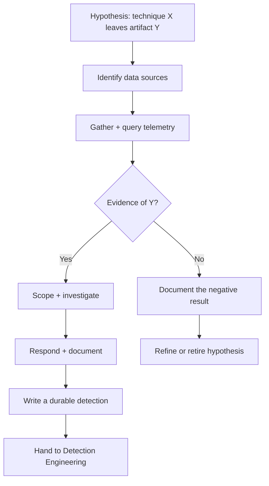

Most defenders spend their time reacting. An alert fires, they investigate, they close it. That loop is useful but it has a blind spot the size of a truck: it only catches what your detections are already looking for.

Threat hunting is the discipline of going looking before the alert fires. You assume something slipped through — because statistically, something always has — and you go look for evidence of it in your own telemetry. No alert required. You start with a hypothesis and go see if the data agrees.

That framing matters a lot. Threat hunting is not "running your SIEM harder." It is not reviewing old alerts. It is proactive, hypothesis-driven search for threats that your existing detections missed. The moment you understand that distinction, the rest of this post makes sense.

---

<figure class="diagram">
  
  <figcaption>The PEAK hunt loop and the Pyramid of Pain — hunt up the pyramid, toward an adversary's behaviour.</figcaption>
</figure>

---

## Why bother hunting at home?

Fair question. You're one person, running a homelab, protecting data that is probably not the target of an APT. The realistic threat model is automated botnets, opportunistic credential-stuffers, and the occasional cryptominer looking for an open door.

Here's why hunting still makes sense:

First, it is the best hands-on education in this field. Reading about adversary behaviour is fine. Hunting through your own telemetry to look for it is a different category of learning entirely. The techniques are the same ones you'd use in a corporate SOC — the stakes are lower, which means you can experiment freely.

Second, every hunt you run produces one of two outputs: an incident you can investigate, or a new detection rule you can add to your monitoring stack. Even a hunt that finds nothing should produce a tested negative and a new detection idea. You're feeding your detection engineering pipeline from post 04 of this series, whether you find something or not.

Third, if you're building blue team skills for a career, "I hunt in my homelab" is a more credible answer than "I read about hunting" — and you'll be able to talk concretely about what you found and what you built afterward.

---

## The PEAK framework

PEAK was developed by the team at Splunk SURGe as a structured methodology for threat hunting. The name is an acronym for the three stages: **Prepare**, **Execute**, and **Act with Knowledge**. It gives you a repeatable loop rather than an ad hoc "I guess I'll look at some logs" session.

### Prepare

This is the upfront work that determines whether your hunt produces anything useful. In this stage you:

- **Choose a hypothesis.** A specific, falsifiable statement about adversary behaviour. Not "let me look for bad things" — that is not a hypothesis. Something like: "if an attacker used scheduled tasks for persistence, I'd expect to see new entries created around the time my telemetry shows unusual activity."
- **Scope the hunt.** What time range? Which hosts? Which data sources? Narrowing scope keeps the hunt manageable and the results interpretable.
- **Identify your data sources.** Do you have the logs to test this hypothesis? If the answer is no, the Prepare stage has already been useful — you've identified a visibility gap.

The best hypotheses come from threat intelligence (what are real actors doing right now?) or from the MITRE ATT&CK framework (what techniques are used for this tactic, and do I have coverage?). More on ATT&CK in a moment.

### Execute

You go get the data and analyze it. In this stage you:

- **Gather and query the telemetry.** Run the queries against your SIEM, log aggregator, or raw log files. Look for the artifact your hypothesis predicts.
- **Analyze and pivot.** If something looks interesting, pivot on it — look at the host in question across other data sources, expand the time window, chase related events.
- **Keep notes.** Every query you ran, every result that looked interesting or definitively normal, every dead end. This documentation is the output of the hunt whether you find something or not.

The goal in this stage is rigorous analysis, not confirmation bias. You are trying to falsify your hypothesis as much as confirm it.

### Act with Knowledge

This stage is where the value gets captured and retained. In this stage you:

- **Document findings.** Positive or negative. What did you look for, what did you find, what did it mean?
- **Create detections.** If you found something, build a detection rule so you don't have to hunt for it manually next time. If you found nothing but the hunt was valid, build the detection anyway — you've just proven the query works and can be automated.
- **Hand off if needed.** In a team context this means escalating to incident response or detection engineering. In a homelab context it means updating your monitoring stack and your runbook.
- **Update your process.** What data source did you wish you had? What hypothesis would you test next? The end of one hunt is the input to the next Prepare stage.

PEAK also defines three types of hunt you can execute within this loop:

- **Hypothesis-driven hunts** — start from a specific technique or behaviour you expect to find evidence of. Most structured hunts are this type.
- **Baseline/exploratory hunts** — look for deviations from what's normal in your environment, without a specific hypothesis. Useful for discovering anomalies you didn't know to look for.
- **Model-assisted hunts (M-ATH)** — use statistical or machine learning models to surface outliers for human analysis. This is the most sophisticated type, and in a homelab context it's probably out of scope until you have strong baseline coverage first.

---

## The Pyramid of Pain

David J. Bianco's Pyramid of Pain frames threat indicators by how much it hurts an adversary when you detect and block them. It runs from the bottom — trivially easy for attackers to change — to the top, where evading detection requires re-engineering their entire operation.

The pyramid, bottom to top:

| Level | Indicator Type | Pain to Adversary |
|---|---|---|
| 1 | Hash values | Trivial — recompile or re-pack, hash changes instantly |
| 2 | IP addresses | Easy — rotate C2 infrastructure, get a new VPS |
| 3 | Domain names | Annoying — register a new domain, update DNS, cost some money |
| 4 | Network/Host artifacts | Significant — specific strings, registry keys, file paths that tools leave behind |
| 5 | Tools | Major — adversary has to find or build different tooling |
| 6 | TTPs (Tactics, Techniques, Procedures) | Maximum — changing TTPs means changing how the adversary operates |

Most security tooling lives at the bottom of the pyramid. Hashes and IPs populate threat intel feeds. Blocking them is cheap for you to do and cheap for attackers to evade. You block a C2 IP, the attacker rotates to a new one in ten minutes.

The goal of threat hunting is to find indicators as high up the pyramid as you can. TTPs are behaviours — the way an adversary moves laterally, establishes persistence, exfiltrates data. These are harder to change because they reflect how the attacker *thinks* about compromising systems. If you can detect the behaviour rather than the specific tool or IP address, you've raised the cost of evading your detection enormously.

This is exactly where MITRE ATT&CK becomes useful.

---

## MITRE ATT&CK as the hunt map

ATT&CK is a knowledge base of adversary tactics, techniques, and sub-techniques observed in real-world attacks. Think of it as a catalogue: for each thing an attacker might do — initial access, persistence, defense evasion, exfiltration — ATT&CK documents what it looks like, what data sources can detect it, and what mitigations exist.

For threat hunting, ATT&CK gives you a structured way to pick your next hypothesis. Instead of "I should look for suspicious things," you can say "I haven't tested my coverage of T1053 — Scheduled Task/Job. Let me build a hypothesis and hunt for it."

A useful hypothesis format:

> If [technique] happened in my environment, I would expect to see [specific artifact] in [specific data source], with [these characteristics].

That structure — if X happened, then Y would be observable — is what makes a hypothesis falsifiable. If you go look for Y and don't find it, you've either confirmed X didn't happen, or you've found a gap in your telemetry. Either outcome is useful.

---

## Data sources you need at home

You can't hunt what you can't see. The minimum viable telemetry stack for a homelab hunt program:

**Sysmon (Windows)** — the Microsoft System Monitor installs as a driver and logs process creation, network connections, file system events, registry changes, and more with far more detail than Windows' built-in event logging. Event ID 1 (process creation) and Event ID 3 (network connection) alone cover a large fraction of common hunting scenarios. If you run any Windows hosts in your lab, Sysmon is non-negotiable.

**auditd + osquery (Linux)** — auditd captures syscall-level activity on Linux hosts; osquery lets you query the OS state (running processes, network connections, loaded kernel modules) using SQL. Together they give you real-time and historical visibility into what's happening on your Linux machines.

**Zeek (network metadata)** — Zeek sits on a network TAP or span port and generates structured logs: connection records, DNS queries, HTTP requests, SSL certificate metadata, and more. It does not capture full packet payloads (no PCAP bloat) — it produces analyst-friendly metadata. Even in a home network, Zeek on a Pi or small VM seeing your LAN traffic tells you things your endpoint logs cannot.

---

## A worked hunt: beaconing via suspicious scheduled tasks

Let's walk through a complete hunt end to end using the PEAK loop.

**Hypothesis (Prepare):**

> If an attacker established persistence using a scheduled task (T1053.005 — Scheduled Task), I would expect to see Sysmon Event ID 1 (process creation) for `schtasks.exe` or `at.exe` with command-line arguments that create a new task, at a time or from a parent process that does not match my normal admin activity. I would also expect to see a corresponding Windows Task Scheduler event (Event ID 4698) in the Security log.

**Data sources identified:** Sysmon Event ID 1, Windows Security Event ID 4698.

**Scope:** All Windows hosts in the lab, last 30 days.

**Execute — the query:**

In a home setup you might be shipping logs to Elasticsearch, a Graylog instance, or even reading raw Sysmon `.evtx` files. Here is the logic in pseudo-SPL (Splunk-style) with comments that translate to any log query tool:

```spl
index=sysmon EventID=1                     # Process creation events only
  (Image="*\\schtasks.exe"                 # Direct schtasks invocation
   OR Image="*\\at.exe")                   # Legacy at.exe — rare but present in old TTPs
  CommandLine="*/create*"                  # Only care about task creation, not query/delete
| eval parent_suspicious=if(
    match(ParentImage, "(?i)(cmd\.exe|powershell\.exe|wscript\.exe|cscript\.exe)"),
    1, 0)                                  # Flag if parent is a shell or scripting host
| where parent_suspicious=1               # Drop routine admin activity (Task Scheduler service, etc.)
| table _time, ComputerName, User, CommandLine, ParentImage, ParentCommandLine
| sort -_time
```

Pair that with:

```spl
index=wineventlog source="WinEventLog:Security" EventCode=4698
# Event 4698 = "A scheduled task was created"
# Contains the task XML: shows trigger, action, author, run-as account
| table _time, ComputerName, TaskName, TaskContent, SubjectUserName
| sort -_time
```

**Interpret the results:**

If both queries return nothing: strong negative — no scheduled tasks were created from suspicious parent processes in this window. Document it and move on.

If Sysmon Event ID 1 shows `powershell.exe` spawning `schtasks.exe /create /sc minute /mo 5 /tn "WindowsUpdate" /tr "C:\Users\Public\update.ps1"` — that is a very loud indicator. Short interval, generic task name designed to blend in, script living in a user-writable path. Investigate that host immediately.

If you find legitimate admin activity that triggered the rule: tune the query to exclude your known-good paths and users, and document the exclusion. You've just made the detection more accurate.

**Outcome and promotion:**

If the hunt finds nothing suspicious, take the query logic and turn it into a persistent alert in your SIEM or log platform. You've validated that the query runs correctly and produces no false positives in your environment. Now it's automated — you don't need to run this hunt manually again unless your environment changes.

If it finds something: you have an incident. Work the incident, then build the detection once you understand the full scope of what happened.

That is the loop. Hunt → find or not-find → build detection → run next hunt.

---

## The PEAK loop as a diagram



---

<div class="callout" markdown="1">
**A hunt that finds nothing still wins.**

The instinct is to measure a hunt's success by whether you found an attacker. That's the wrong metric. A hunt that produces a tested negative — "I looked for T1053 evidence across 30 days of logs and found nothing suspicious" — has three real outputs: you confirmed your telemetry covers this technique, you validated the query works correctly in your environment, and you have a detection rule ready to deploy. None of that requires finding an actual incident. The moment you let "finding nothing means wasted time" creep in, you'll start chasing false positives to justify the work. Resist that. Document the negative, deploy the detection, move to the next hypothesis.
</div>

---

<div class="sidebar-note" markdown="1">
**How I run hunts in mine.**

I pick techniques from ATT&CK that I haven't covered yet in my detection stack and work through them one at a time. Before I run a hunt I write down the hypothesis in plain English, identify which logs I'd need to test it, and confirm I'm actually collecting those logs before I start querying. I keep a plain text hunt log — date, technique, hypothesis, queries I ran, what I found, what detection came out of it. That file has become one of the more useful things in my homelab. When I'm tuning a detection later, I can go back and see exactly what the data looked like when I built it.
</div>

---

## Hunting up the Pyramid

One practical note on prioritizing your hunts: start at the bottom of the Pyramid of Pain and work up, but *aim* for the top.

Starting low (hashes, IPs) is easy and gives you quick wins, but those detections are fragile — an attacker can evade them trivially. Over time, push your hunts toward artifacts and TTPs. A hunt for "PowerShell spawned from a document viewer" is harder to build and tune than a hash blocklist, but it catches a whole class of attacks regardless of what specific payload was used. That's the goal: detection rules that are robust against evasion because they target behaviour, not indicators.

ATT&CK maps every technique to observable artifacts in specific data sources. Use that mapping to work through your stack systematically. Sub-technique T1059.001 (PowerShell) → data source: Process creation, Command execution → look for Sysmon Event ID 1 with `powershell.exe` and suspicious command-line flags. T1078 (Valid Accounts) → Logon events → look for authentication from unusual source IPs or at unusual hours. Each hunt tells you something about your visibility and adds a layer to your detection coverage.

---

## Quick reference: hunt planning checklist

| Step | Question to answer |
|---|---|
| Hypothesis | What technique am I testing? Is this falsifiable? |
| ATT&CK mapping | What's the technique ID? What data sources does ATT&CK recommend? |
| Data availability | Do I actually collect those logs? If not, gap identified — stop here |
| Scope | Which hosts? What time range? |
| Query | What query logic tests the hypothesis? |
| Baseline | What does normal look like? What should I exclude? |
| Output | What detection rule does this hunt produce? |
| Documentation | Where does this go in my hunt log? |

---

## Next Up

Post 03 covers threat intelligence at home — how to consume, filter, and operationalize external threat intel without drowning in noise: [Threat Intelligence: Signal vs. Noise at Home]().

---

*Previous: [Building a home SOC: the architecture]()*
