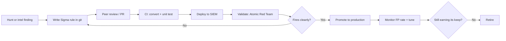

Most security teams have a graveyard of detections. Rules written in a moment of panic after an incident, clicked into the SIEM console, never documented, never tested, and running continuously until someone finally notices they haven't fired in eighteen months — or worse, they've been firing constantly and everyone learned to ignore them. A detection that nobody trusts is worse than no detection: it trains people to ignore the signal.

Detection engineering is the discipline of treating detections like software. Not as one-off queries you configure through a UI and hope for the best, but as a durable product with a lifecycle: authored, reviewed, tested, deployed, tuned, and eventually retired. Everything that makes software maintainable — version control, peer review, automated testing, documented intent — applies here too.

This post works through what that means in practice for a home blue team setup.

---

<figure class="diagram">
  
  <figcaption>Detections as code — the same review-test-deploy-tune loop software gets.</figcaption>
</figure>

---

## What detection engineering actually is

The term sounds more enterprise than it is. The core idea is simple: a detection is code, and code should be treated like code.

That means:

- **It lives in version control.** You can see every change, who made it, and why. You can roll back if a change causes noise.
- **It has documented intent.** Not just what it looks for, but why — what adversary behaviour it maps to, what it assumes about the environment, what it's known to miss.
- **It's tested before it goes live.** Not "I ran it and it didn't error." Tested as in: someone intentionally triggered the condition and confirmed the detection fired.
- **It has an owner.** Detections don't maintain themselves. Someone is responsible for knowing whether it still makes sense six months from now.

The alternative — clicking a detection into a SIEM console with no documentation, no test, and no review — produces a pile of rules that nobody understands well enough to tune. When the environment changes, nobody knows which detections will break. When something fires at 2 AM, nobody remembers what the rule was supposed to catch.

For a home lab, the stakes are lower, but the discipline is worth building. Learning to do it right when the consequences are minor means you'll do it right when the consequences aren't.

---

## Detections as code

The practical implementation of detection-as-code looks like this:

**Every detection lives in a git repository.** A directory per detection, a YAML file with the rule, and a short document explaining what it is and why it exists. PRs to add or change detections get reviewed before they're merged. The merge history is an audit trail.

**CI runs on every PR.** At minimum, a syntax check. If you're using Sigma (more on that below), CI converts the rule to your SIEM's query language and confirms it compiles without error. If you've written unit tests — input events that should and shouldn't match — CI runs those too.

**Deployment is automated from main.** Merging to main triggers a sync to your SIEM. You never manually paste a rule into a console. The console reflects exactly what's in git, no more and no less.

**Everything is auditable.** A detection that exists in the SIEM but not in git is a defect. A rule edited directly in the console is a defect. The git repo is the source of truth, and anything that diverges from it is wrong.

This sounds heavyweight for a homelab. In practice, you can implement a lightweight version with a single git repo, a GitHub Actions workflow that runs `sigma-cli` on push, and a script that syncs rules to your SIEM on merge. The friction of doing it this way is low. The payoff — knowing exactly what you're running and why — is real.

---

## Sigma: write once, convert anywhere

Sigma is a generic, vendor-agnostic detection rule format. You write a rule in YAML once, and a converter tool translates it into the query language your specific SIEM understands — whether that's Splunk SPL, Elasticsearch Query DSL, OpenSearch, QRadar, or something else. This matters because it means your detection library isn't married to one product.

A Sigma rule has a handful of required sections: metadata about the rule (title, status, description), a `logsource` block that says what kind of events this rule applies to, a `detection` block that defines what to look for, and metadata like `level` (low, medium, high, critical) and `tags` to map to MITRE ATT&CK techniques.

Here's a small, real example — detecting the kind of local reconnaissance that shows up early in many intrusions: a user running `whoami`, `net user`, or `net localgroup` in quick succession.

```yaml
title: Suspicious Local Recon Commands
id: 7b3d1a0f-912c-4e8d-a9b2-c5f87d6e2301
status: experimental
description: >
  Detects sequential execution of common local reconnaissance commands
  used to enumerate the current user, local accounts, and group memberships.
  Typically seen in the early stages of post-exploitation.
references:
  - https://attack.mitre.org/techniques/T1033/
  - https://attack.mitre.org/techniques/T1069/001/
author: MrK
date: 2026-08-14
tags:
  - attack.discovery
  - attack.t1033
  - attack.t1069.001
logsource:
  category: process_creation
  product: windows
detection:
  selection:
    CommandLine|contains:
      - whoami
      - 'net user'
      - 'net localgroup'
  condition: selection
falsepositives:
  - Legitimate sysadmin activity
  - Automated IT management scripts
level: low
```

A few things worth noting about this structure. The `logsource` section — `category: process_creation, product: windows` — tells the converter which data source this applies to. The `detection.selection` defines what a matching event looks like; `condition: selection` means "alert when any event matches the selection." For more complex rules you can combine multiple named selections with boolean logic: `condition: selection1 and not filter`.

The `falsepositives` section isn't enforced by the tooling. It's documentation for whoever is looking at an alert at 2 AM. That matters.

To convert this to an Elasticsearch query:

```bash
# Install sigma-cli and the Elasticsearch backend
pip install sigma-cli
sigma plugin install elasticsearch

# Convert the rule
sigma convert -t elasticsearch -p ecs-windows recon-commands.yml
```

The output is a query you can paste directly into Elastic. If you're using Splunk, swap `-t elasticsearch` for `-t splunk`. The rule itself doesn't change.

---

## The detection lifecycle

A detection has a life beyond the moment you write it. Understanding the full arc changes how you build them.

**Idea / hypothesis.** Most good detections start with a question: "if an attacker did X, what would that look like in our logs?" The source might be a threat hunt (you found something suspicious, and now you want an automated signal for it — see the [threat hunting post]()), or a piece of threat intelligence (a TTP is associated with a relevant threat actor — see [the intel post]()), or a post-mortem from an actual incident. This is the hypothesis stage: you have a theory about what bad looks like.

**Develop.** Turn the hypothesis into a detection rule. Write the Sigma YAML. Write the intent documentation. Write down what you think it will miss and what you expect to generate false positives on.

**Test.** Before this goes anywhere near production, you need to confirm it actually works. More on this below. Skip this step and you have a hypothesis masquerading as a control.

**Deploy.** Merge to main. The CI/CD pipeline converts and syncs it to your SIEM. The detection is now live.

**Tune.** The first weeks in production reveal the false positive rate. Legitimate admin scripts that match the pattern. Monitoring agents that look suspicious. Each false positive is a tuning opportunity: add a filter, tighten the condition, document the known-good pattern. Every tuning change goes through the same PR process.

**Retire.** The technology being monitored was decommissioned. A better, broader detection superseded this one. The false positive rate is unmanageable and the signal-to-noise ratio never improved. Not every detection earns indefinite production status. Retiring a detection is a deliberate decision, not benign neglect — and it's healthier than keeping a noisy rule that everyone learns to ignore.

---

## The ADS framework

Palantir published the Alerting & Detection Strategy (ADS) framework as a structured template for documenting what a detection is and why it exists. The idea is that every detection should have a corresponding ADS document, and that document should contain enough context for a stranger to understand, maintain, and eventually retire the rule.

The sections:

**Goal.** One or two sentences. What adversary behaviour or event does this detection target?

**Categorization.** The MITRE ATT&CK technique (or techniques) this maps to. Not because ATT&CK is gospel, but because it's a shared vocabulary that tells you where in the kill chain this fires.

**Strategy Abstract.** How does the detection work? What data source does it use? What does a matching event look like?

**Technical Context.** What do you need to know about the environment for this detection to make sense? What logging must be enabled? What systems must be generating the relevant events?

**Blind Spots and Assumptions.** What does this detection miss? If the attacker runs the same recon commands as a service account that's in your allowlist, this won't fire. Say so. If this assumes Windows event ID 4688 is enabled, say so. Making the blind spots explicit is more valuable than pretending they don't exist.

**False Positives.** Known benign conditions that will match. Sysadmin activity, monitoring agents, automated scripts. The more specific the better — "IT management scripts" is less useful than "the Ansible playbook `baseline-audit.yml` generates this event on every run."

**Validation.** How was this detection tested? What tool, what technique, what result? This section closes the loop on whether the detection actually fires.

**Priority.** The severity level when this fires and how it should be treated in triage.

**Response.** What should happen when this fires? Not an exhaustive runbook, but the key questions to answer first.

Writing an ADS document for every detection takes maybe fifteen minutes. What it buys you is a detection that someone else — or future you — can actually maintain. A rule file with no documentation is a black box. With the ADS template it's a defensible artifact.

---

## Testing your detections

This is where most home blue teamers skip a step, and it's the most important step in the whole pipeline.

**Atomic Red Team** is a library of small, targeted tests — "atomics" — mapped directly to MITRE ATT&CK techniques. Each atomic is a minimal, documented way to trigger a specific behaviour. Run the atomic, check whether your detection fired. If it didn't fire, you have a hypothesis, not a control.

```bash
# Install Atomic Red Team (PowerShell, on a test Windows machine)
IEX (IWR 'https://raw.githubusercontent.com/redcanaryco/invoke-atomicredteam/master/install-atomicredteam.ps1' -UseBasicParsing)

# Run the atomic for T1033 - System Owner/User Discovery
Invoke-AtomicTest T1033 -TestNumbers 1

# Run the atomic for T1069.001 - Local Groups
Invoke-AtomicTest T1069.001 -TestNumbers 1
```

If your detection fires: promote the rule to production. Document the validation result in the ADS document. If it doesn't fire: go back to the rule. The log source might not be generating the expected event. The query logic might be wrong. Something is missing. The atomic doesn't lie — if the behaviour happened and the detection didn't fire, the gap is in your detection, not in the test.

**CALDERA** is a step up: a full adversary emulation platform where you define an operation (a sequence of ATT&CK techniques) and let it run against a test host, then check how many steps your detection coverage caught. This is overkill for a first homelab detection setup, but it becomes useful once you have enough rules to want to measure coverage systematically.

The important mindset shift: testing isn't optional polish at the end of the process. It's the step that determines whether you have a detection or a guess. Run the test before you put the rule in production. Every time.

---

<div class="callout" markdown="1">
**Field note: a detection you haven't tested is a hypothesis, not a control.**

The rule being in the SIEM does not mean it works. The rule having no errors does not mean it fires on the right events. The only thing that means a detection works is: you intentionally triggered the condition it's supposed to catch, and it caught it. Until you've done that, you have a hypothesis that happens to live in production. The Atomic Red Team library exists specifically to make this test cheap and repeatable. There is no excuse for skipping it.
</div>

---

## False positives are the real enemy

A detection that fires accurately on malicious behaviour is useful. A detection that fires on everything is noise, and noise is how alerts become something people learn to click through without reading.

False positive tuning is ongoing, not a one-time activity. When a detection fires in production and the activity turns out to be benign, that's not a failure — it's data. Add the filter. Document the known-good pattern in the ADS. Retest. Merge.

The thing to watch for is detection hoarding: keeping noisy rules active because they feel safer than retiring them. A detection with a 99% false positive rate costs your future self more attention than it's worth. If a detection consistently produces noise and you've tried to tune it and it's still noisy, retire it. Write a better one if the underlying hypothesis is still valid.

The metric that matters isn't "how many detections do we have." It's "how often does a detection fire on something worth looking at." Fewer high-fidelity rules beat a large collection of unreliable ones. This is uncomfortable to accept because more rules feel like better coverage, but the analyst who's learned to ignore the noise in a high-volume SIEM is more dangerous than an analyst with a smaller, trustworthy signal.

---



---

<div class="sidebar-note" markdown="1">
**How I run mine.**

Detections live in a git repo, one directory per rule. The directory contains the Sigma YAML and a short markdown file with the detection's intent, assumptions, known false positives, and test result. A GitHub Actions workflow converts every rule on push using sigma-cli and fails the build if any rule doesn't parse clean.

I run Atomic Red Team tests on a dedicated Windows VM that I snapshot before each test and restore after. The snapshot-restore loop means the test host is always clean and the results are reproducible. When a new rule passes validation, I note the atomic test number and result in the ADS document before merging.

I try not to have rules I can't explain. If a detection fires and I'd have to go re-read the rule to understand what it's doing, it needs better documentation. The standard I aim for: a rule I wrote six months ago should be self-explanatory when it fires at 2 AM.
</div>

---

## A note on coverage vs. fidelity

The natural progression is to want more coverage — a detection for every ATT&CK technique. Resist this. Coverage without fidelity is how you build a SIEM full of noise.

A better approach: start with a handful of high-signal, high-fidelity detections for behaviours that are almost never benign. Process injection, LSASS access, unusual parent-child process relationships, outbound connections from processes that have no business making them. Get those right and tuned before expanding. Each new rule you add is a maintenance burden — make sure it earns its keep.

The ATT&CK navigator is useful here as a visual gap analysis tool, but use it as a map, not a checklist. The goal is trustworthy coverage of the things that matter for your threat model, not coloured cells in a spreadsheet.

---

## Next Up

[Automation and SOAR: making your homelab respond, not just alert]() — when detections fire, what happens next shouldn't depend on a human being awake.

---

*Previous: [Threat intelligence that isn't just a feed]()*
