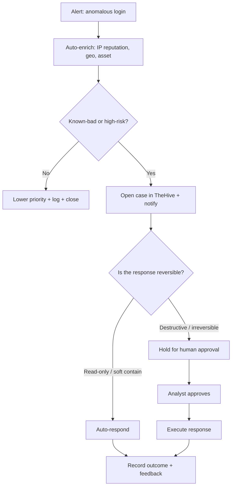

Five posts in, you have detection rules firing alerts, threat intel feeds enriching your context, and a hunting process that surfaces things your rules missed. What you probably also have is a growing pile of alerts that need the same five manual steps every single time: look up the IP, check the hash, figure out whether the asset is important, open a ticket, tell someone.

That's automation work, not analyst work. SOAR is how you take it back.

This post covers Security Orchestration, Automation, and Response at the home-lab scale — what it actually is, what to automate first, and the guardrail you must not skip. Because you can absolutely automate your way into deleting a running service or locking yourself out of your own accounts. That's a fun story to tell later, less fun to live through.

---

<figure class="diagram">
  
  <figcaption>A SOAR playbook — automate enrichment freely, gate anything destructive behind a human.</figcaption>
</figure>

---

## What SOAR Actually Means

SOAR is three things bundled into one acronym, and they're worth separating because they have very different risk profiles:

**Security Orchestration** — connecting your tools so they can talk to each other. Your SIEM sends an alert to your case management system, which calls your threat intel platform, which writes results back to the case. Orchestration is plumbing. It's low-risk and high-value.

**Automation** — replacing manual steps with scripts. Instead of you tabbing over to VirusTotal and copy-pasting a hash, a workflow does it in two seconds and writes the result into the alert record. Automation is also generally low-risk when it stays read-only.

**Response** — actually doing something to your environment in reaction to an alert. Blocking an IP at the firewall. Disabling a user account. Isolating a host from the network. This is where risk gets real.

Most SOAR tutorials gloss over this distinction and treat it like a smooth continuum. It's not. The gap between "look up a reputation score" and "kill a running session" is significant, and how you handle that gap determines whether automation helps you or causes its own incident.

At home, you're running SOAR with a team of one. That means there's nobody else to check your playbook before it runs, and "I'll just automate the response too" is a shorter path to a self-inflicted outage than you'd think.

---

## What to Automate First

The highest-leverage automation targets are the things that are high-volume, low-stakes, and identical every time. In practice that's four categories:

**Enrichment** — every alert that mentions an IP, domain, file hash, or email address needs the same context: is it known-bad, where is it geographically, when was it last seen in threat intel, is the asset it touched important? Automating enrichment means every alert arrives with that context already filled in. Your triage time drops from ten minutes to thirty seconds because the legwork is done.

**Alert triage and deduplication** — if the same external scanner hits your SSH port forty times in an hour, that's one event, not forty alerts. Automation can correlate and deduplicate before anything reaches your queue. A clean queue is a queue you'll actually work.

**Notifications** — alerting the right person (in a home lab, that's you) in the right channel at the right time. A high-severity alert at 2 AM probably wants a push notification. A low-severity log anomaly probably wants a daily digest. Routing decisions like these are easy to codify.

**Case and ticket creation** — when something does need human attention, the case should already exist with enrichment attached by the time you look at it. Creating cases manually is overhead that adds no analytical value.

**Clear-cut containment** — the narrowest category, and the one with the most caveats. A small number of automated responses are safe enough to run without human review: adding an IP to a watchlist, dropping a connection at the network perimeter when a feed has already confirmed it's active C2 infrastructure. But the line here is narrow. More on that in the next section.

The other 20% — the cases that need judgment, the alerts with ambiguous context, the response actions that affect running services — those need a human. Automation should be buying back time so that human can think, not trying to replace the thinking.

---

## The Playbook Concept

A playbook is just a documented, executable workflow: given trigger X, do steps A, B, C, then record what happened.

The basic structure is consistent regardless of the tool:

1. **Trigger** — something fires. An alert from your SIEM, a new entry in a threat intel feed, a threshold crossed in your metrics, a file landing in a watched directory.
2. **Enrich** — gather context automatically. IP reputation, domain age, hash verdict, asset criticality, related historical events.
3. **Decide** — based on what enrichment found, route the alert. Is this obviously benign? Close it with a note. Is this high-confidence malicious? Escalate. Everything else: queue for review.
4. **Act** — execute the appropriate response. Read-only (log, notify, create a case) or active (contain, block) — more on this shortly.
5. **Record and feed back** — write outcomes back to the case, close the loop. What happened, what was decided, what was done, by whom or by what. This record is what you use to tune the playbook later.

The record-and-feedback step is where most home implementations cut corners, and it's the one that compounds. Playbooks that don't record outcomes can't improve. Six months in you have no idea whether the enrichment step is actually informing decisions or just adding noise.

---

**The guardrail rule — read this before you automate anything.**

Destructive and irreversible actions must always require explicit human approval before execution. No exceptions.

What counts as destructive or irreversible: disabling a user account, isolating a host from the network, deleting a file, blocking an IP at your router or firewall, terminating a running process or container. Anything that you cannot trivially undo in under two minutes.

What can run automatically without human approval: lookups, enrichment, notifications, case creation, adding to a watchlist, generating a report.

The failure mode here is real. A false-positive detection that auto-isolates a host can bring down a running service. An automation bug that disables accounts can lock you out of your own infrastructure. These things happen in production SOCs with teams of engineers reviewing playbooks. At home, with one person, the blast radius of a bad automation decision is the entire lab.

Automate the boring stuff. Gate the sharp stuff. This is not excessive caution — it's the right threat model for a solo operator.

---

## Tools Worth Knowing

This is the part where I give you a table instead of a wall of text, because your home threat model doesn't need a 3000-word comparison of enterprise SOAR platforms.

| Tool | What it is | Effort to deploy |
|---|---|---|
| **Shuffle** | Open-source SOAR — visual playbook builder, 800+ app integrations, REST hooks. Closest thing to an enterprise SOAR without the price tag. | Medium — Docker Compose, some YAML wrangling |
| **Tines** | Commercial SOAR with a genuinely generous free community tier. Polished UI, good docs, lots of examples. | Low — hosted, no infra to manage |
| **n8n** | General-purpose workflow automation. Not purpose-built for security, but exceptional glue between tools — especially for enrichment pipelines and notifications. Self-hostable. | Low to medium — Docker, clean web UI |
| **TheHive** | Open-source case management platform. Where alerts become cases, cases get enrichment attached, and analysts track what happened. Pairs with Cortex for automated analysis. | Medium — Docker stack, database setup |
| **Cortex** | TheHive's analysis engine. Runs "analyzers" — connectors to enrichment services — automatically when a case is created. Deep VirusTotal, Shodan, and threat intel integrations. | Medium — typically deployed alongside TheHive |

The MISP integration from [part 3]() fits here naturally — Cortex has a MISP analyzer, and Shuffle has native MISP actions. Once your threat intel platform is connected to your case management and your case management is connected to your automation layer, enrichment starts flowing without manual steps.

For a home lab starting point: n8n for orchestration and notification plumbing, TheHive for case management, and Shuffle when you want to build more structured playbooks. You don't need all three on day one.

---

## A Worked Playbook: Anomalous Login Alert

Here's a concrete example end to end. The scenario: your detection rule from [part 4]() fires on a login from an unusual source IP — either a new location, an unusual hour, or an IP that doesn't fit the normal pattern for this account.

**Step 1 — Alert fires, playbook triggers.**
The SIEM (or log analysis tool, or whatever you're running) generates an alert with: source IP, account, timestamp, source application.

**Step 2 — Auto-enrich the source IP.**
The playbook immediately fires off parallel lookups:
- ThreatFox / OTX for known-bad reputation
- Geo IP lookup for country, city, ASN
- Your internal asset inventory: is this IP in your known-good list?

This takes three to eight seconds. No human involvement.

**Step 3 — Evaluate travel plausibility.**
If you have a previous login on record, the playbook checks: could this person physically be in both locations given the time delta? A login from your home city and then Toronto two hours later — plausible. A login from home and then Singapore four minutes later — not plausible.

**Step 4 — Risk decision.**

*If the IP is in a threat feed or the travel is impossible:* the alert is classified high-risk. Proceed to Step 5.

*If the IP is clean and the travel is plausible:* lower priority. Log the event, attach the enrichment, close the alert with a note. No human required.

**Step 5 — Open a case, notify.**
TheHive gets a new case created automatically, with all enrichment attached. You get a push notification with a summary: source IP, reputation verdict, geo, the travel-plausibility result, and a link to the case.

At this point, you are informed and a case exists. Nothing destructive has happened yet.

**Step 6 — Human decision gate.**
The case in TheHive shows two action buttons: **Approve containment** or **Dismiss as false positive**.

If you dismiss it: the case closes, the enrichment is logged, the playbook records your decision.

If you approve: the playbook runs the response — in this example, ending the active session for that account and flagging it for password review. Because you clicked a button to authorize it, you knew it was coming and can reverse it if needed.

**Step 7 — Record outcome.**
Whatever happened — dismissed, confirmed, contained — gets written back to the case. Time from alert to decision, who acted, what ran. This is your audit trail and your playbook improvement data.

The gate at Step 6 is the entire point. Enrichment runs automatically. Notification runs automatically. Containment does not run automatically. A human was in the loop for the step that mattered.

---

## The Flowchart

---

**How I run mine.**

The enrichment layer runs automatically on anything that fires — reputation lookups, geo, asset context — using n8n as the glue between alert sources and TheHive. A new case lands with context already filled in, which is the single change that made triage feel manageable instead of exhausting.

Notifications hit me in one channel at one severity threshold. I used to alert on too many things, which meant I started ignoring alerts, which is worse than no alerting at all. Tuning it down to "only tell me things that need a decision" was the right call.

For response, nothing runs without my explicit click. The button exists in the case. I have not yet wished I'd automated past it.

---

## Closing the Loop — The Whole Series

Here's what the five disciplines look like when they're connected:

Automation buys back the time you were spending on repetitive triage. You spend that time hunting — going looking for things your rules haven't caught yet, the way we covered in [part 2](). The things you find while hunting become detections — you take the pattern, convert it to a rule, and codify it, which is what [part 4]() was about. Those detections fire alerts. Automation triages the alerts. And so it runs.

The five disciplines aren't a checklist you work through once. They're a loop that feeds itself. Better detections generate cleaner alerts. Cleaner alerts make automation more reliable. More reliable automation frees analyst time. Analyst time goes to hunting. Hunting improves detection.

That loop is what a mature security practice actually looks like, regardless of whether it's running in a home lab or an enterprise. The tools are different. The logic isn't.

The map at [the start of this series]() laid all five disciplines out before we built any of them. Go back and read it now if you want — it hits differently once you've worked through each post.

---

## Where to Go From Here

This is the end of the Blue Team Homelab series, but it's not the end of the build.

If I were starting fresh with what I know now, I'd pick one of these five disciplines — whichever connects most directly to a real problem you have today — and go deep on it before touching the others. Not because the others don't matter. Because shallow coverage of all five teaches you less than genuine fluency in one, and fluency in one pulls you naturally into the next.

The right starting point for most people is detection engineering. Writing a rule and watching it fire on something real is the fastest way to understand why all the other pieces exist. From there, threat intel and hunting expand your scope. Automation scales what you've built. But you have to have something worth scaling first.

Pick the thread that pulls hardest. Follow it.

The series starts at [Why a Home SOC?]() if you want to send someone to the beginning.

---

*Previous: [Detection engineering: detections as code]()*
